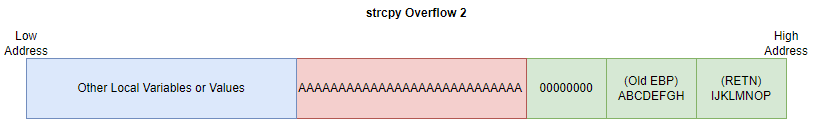
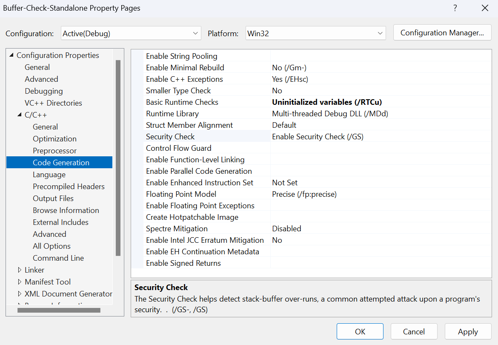

# Buffer Security Checks
Buffer security checks are implemented on most systems and are one of the oldest mitigation techniques being introduced in the Visual Studio 2002 C++ Compiler and is used to prevent buffer overflows. The Windows impletion of this, protects against overflows of objects located on the *stack*. This is done by allocation something known as a *security cookie* which as also commonly called a *stack canary* onto the stack in a location that would need to be overwritten by the overflow in order to modify the critical sections of data on the stack. Then when the program attempts to access a protected value on the stack, be that an argument or return address it will first check to see if the *security cookie* has been changed and if so, we know an overflow likely occurred. This is why the *security cookie* is often referred to as a *stack canary* due to the use of [canaries in mineshaft](https://review.gale.com/2020/09/08/canaries-in-the-coal-mine/) to detect dangerous situations.

> [!NOTE]
> There are alternate uses for the term *canary* in cybersecurity [7], when we use the term *canary* in this document we are referring to *Stack Canaries*!

## Security Cookies Locations and Checks
In order for security cookies to be effective, they need to be placed between the critical data and a buffer that can be overflowed to corrupt or modify that critical data. Windows implements security cookies for the *stack* this means of course that the security cookie will be placed on the stack between the buffer or object that could be overflowed and the section that contains the critical data [1][2]. But first before we find out where the security cookies are placed, we need to know when they will be used.

### Security Cookie Allocation
A security cookie will be inserted and checked when any one of the the following is contained in the function [1]:
* An array that is larger than 4-bytes is allocated.
  * *Does not* contain pointer type objects.
  * *Consists of* more than two elements.
* A data structure that is 8-bytes or larger is allocated.
  * *Does not* contain pointer type objects
* A buffer is allocated using the [`_alloca(...)`](https://learn.microsoft.com/en-us/cpp/c-runtime-library/reference/alloca?view=msvc-170) function.
* A structure is allocated that contains a variable or structure that meets one of the previously mentioned conditions.

> [!IMPORTANT]
> Microsoft refers to these types of objects as a `GS Buffer`.

In [1] they provide the following examples of *GS Buffer* allocations that would lead to a security cookie being inserted and checked at runtime:
```c
// Array > 4-bytes (20 Bytes), contains > 2 elements (20)
// that are not pointers
char buffer[20];

// Array > 4 Bytes (80 Bytes), contains > 2 elements (20)
// that are not pointers
int buffer[20];

// Structure > 8 Bytes (16 + padding)
struct { int a; int b; int c; int d; } myStruct;

// Structure containing a buffer > 4 Bytes (20 Bytes) & 
// contains > 2 elements (20) that are not pointers
struct { int a; char buf[20]; };
```

In [1] They also provide an example to show what *are not* *GS Buffer* allocations: 
```c
// Array > 4-Bytes (80-bytes on x86, 160-bytes on x86-64)
// However, this is an array of pointers!
char *pBuf[20];

// Array > 4-Bytes (80-bytes on x86, 160-bytes on x86-64)
// However, this is an array of pointers!
void *pv[20];

// Array <= 4-bytes (4-bytes)
char buf[4];

// Array only contains 2 elements
int buf[2];

// Structure is <= 8-bytes on x86 systems with 4-byte padding
// If padding is 8-bytes then it would be > 8-bytes.
struct { int a; int b; };
```
### Security Cookie Location (Stack)
As the stack grows from a *high* address to a *low* address, and the buffers allocated on the stack are written to from a *low address* to a *high address* in order to protect the critical sections of data on the stack, the security cookies are allocated *above* the vulnerable GS Buffers as they would need to overwrite the security cookie in order to modify the critical data sections.


> [!NOTE]
> If we were to have a local exception handler like an SEH chain entry, the security cookie would also be allocated between this and the vulnerable buffers. This is because the exception handling entry would be allocated after the old base pointer and return address. [2]

### Additional Relocations
Depending on the compiler options and function characteristics additional relocations of objects allocated on the stack may occur. First, the objects that are classified as GS Buffers, which may be subject to being overflowed are allocated before (*above*) other local variables [2]. This is to prevent the modification of local variables that could be used to exploit the system before the security cookie's integrity is verified when function returns. The function may also have arguments that are considered to be vulnerable to overflows. If this is the case and the following conditions are *met* then they will be copied to be placed *after* the vulnerable buffers [1].

* Optimizations `/O` compiler flags are used.
* Function contains one or more GS Buffers.
* Function **does not** contain a variable argument list `...`.
* Function is **not** marked with the [`naked`](https://learn.microsoft.com/en-us/cpp/cpp/naked-cpp?view=msvc-170) attribute. If marked with `naked` the function will not contain prolog and epilog code.
* Function does not contain *inline assembly* as part of the **first** statement.
* Parameters **are used** in ways that may be exploitable in the event of a buffer overflow. 


If those conditions are met, we can have a stack that looks like the following:


## Security Cookie/Canary Types
When it comes to what a *security cookie* or *stack canary* is the answer at first seems relatively simple. They are a *value* placed on the stack when the function is called, and this *value* is then checked when accessing critical data. However, the most important question still remains! What is the value placed on the stack? 

There are a few classes of stack canaries and in modern implementations they may be a mixture of characteristics associated with these classes.

### Terminator Canaries
As most overflows leverage unsafe string operations like `scanf(...)`, `gets(...)`, `strcpy(...)`, `sprintf(...)`, etc. This canary leverages the fact that certain characters act as terminators, signifying the end of a C style string. Examples of terminating characters include the *null-terminator* `'\0'` with the value of `0x00` or depending on the operation used the *newline (Line Feed)* character `'\n'` with the value of `0x0A`. Filing a series of 4-bytes in a 32-bit system or 8-bytes in a 64-bit system with a terminating character makes it difficult for an attacker to overflow past the *security cookie*/*canary* using unsafe string operations without changing the canaries's value as the string would be terminated before reaching the target of the overflow. If the attacker did use an unsafe string operation to overflow past the canary, then it's value would have been changed and the overflow detected. 

Below are a series of images that attempt to showcase how a *terminator canary* would work:

1. We have a initial stack state. With a canary filled with null-terminators `\0` with the hex value `0x00`, a valid old base pointer and return address.

    

2. We can look at what happens if we overflow the canary using a string operation like `strcpy(...)`, in order to reach the return address we would need to overwrite the canary with non-terminator values.

    

   * In this case since we changed the value of the canary, the overflow is detected when the function returns and the program will terminate.

3. If we attempt to overflow the canary with a string that contains the null-terminators so we do not change the value of the canary on the stack. In this case since we would be using a string operation like `strcpy(...)` to preform the overflow once a null-terminator is reached the function stops. This means the overflow would not change the canary, but it would also not reach the return address.

    


### Random Canaries
As various functions like `memcpy(...)`, `read(...)`, `bcopy(...)`, `recv(...)`, etc exist. Which copy, read, or receive streams of *bytes* and store them at a location the programmer specified regardless of what those bytes are the *terminator canaries* are not particularly effective. This means unlike the function that operate on string discussed in the previous section, characters that serve as *terminators* can be sent to the program and written to memeory when these functions are used. This means if a program used *terminator canaries* which would be a **constant and known** value an attacker would be able to bypass them if one of these functions were used. As the attacker can find the location of the canary and simply overwrite it with the *terminator* characters that had been there previously before continuing on to overwrite the critical data. 

In order to prevent the canary from being defeated so easily by being a **constant and known** value when these functions are the root of the overflow, an alternative kind of canary consisting of a random string of 4-bytes in a 32-bit system or 8-bytes in a 64-bit system. This way, when the function is called a random unknown *security cookie*/*canary* is inserted onto the stack which the attacker does not know. So in order for an attacker to exploit a buffer overflow vulnerability when *random canaries* are used the attacker would need to leak the canary without crashing the program, or get the same canary multiple times in a row allowing them to guess the canary.

> [!NOTE]
> Considering the canary on 32-bit systems is only... 32-bits and on a 64-bit system it is only... 64 enumerating all possible combinations of bits is not an impossible feat. However when the canary changes each time you launch the executable we are no longer enumerating a static target and guessing it becomes less feasible.


Below are a series of images that attempt to showcase how a *terminator canary* could be bypassed with a function like `recv(...)`:
1. We have a initial stack state. With a canary filled with null-terminators `\0` with the hex value `0x00`, a valid old base pointer and return address.

    

2. As the `memcpy(...)` function can receive and write the null-terminator character to memory it is possible to have a string or chunk of memory like `AAAAA\0\0\0\0AAAA...` which is then used to overflow the buffer, while overwriting the *terminator canary* with it's original known value and still be able to overwrite the return address.

    


Now we can examine how a random canary would help prevent this:

1. We have a initial stack state. With a canary filled with a *random* series of bytes, a valid old base pointer and return address.

    

2. We then preform the overflow, in this case we only overflow the first byte attempting to guess it. As the canary is now invalid the program is terminated.

    

   * This would lead the program to a crashed state when the function returns as the canary is no longer valid as it was changed.
3. Once the program restarts we have a new stack canary! When we attempt to overflow it again, guessing a different first byte. However as the canary changed the first byte could have been our previous guess.

    


> [!NOTE]
> This constant changing between crashes make it harder to brute force the stack canary. If we are on a 32-bit system it is possible. However on a 64-bit system this becomes more unreasonable with our current systems today.
### XOR Canaries
Depending on the behavior of a program it is still possible to defeat *random canaries*, as mentioned previously we can still leak information from the programs stack. In that case knowing the random canary you can overwrite it with the original values to remain undetected. Additionally as discussed in [5] if a program were to have behavior similar to a Linux `fork(...)` where the executing process is copied and inherits the security cookies and seed values without re-randomization you could guess the *random canary* one byte at a time until the server stops crashing; then you know the canary has been successfully guessed. 

> [!NOTE]
> As Windows **does not** have a function like `fork(...)` and re-randomizes each sub-process created we do not have to worry that much about the attack discussed in [5] however it is something to keep in mind.

Because of this, we can apply an alternative strategy to mitigate the impact leaking the stack canary or iteratively guessing it has on the security of our system. This strategy is preforming an XOR operation on a random 4-byte value on 32-bit systems or a 8-byte value on 64-bit systems with the return address or more commonly the base pointer of a function. This way, if an attacker were to leak the stack canary and overwrite it with the original value but they changed the return address or the base pointer's value it will still fail the check. As when the program attempts to return and preforms the XOR operation on the random value and the current return address or base pointer it will be incorrect if either the security cookie or XORed value has changed. Still the attacker can bypass this if they overwrite other critical sections like the saved based pointer for *ebp*/*rbp* or if they were to overwrite non-protected data segments containing functions pointer [6]; though this is partially mitigated by protections such as [*Control Flow Guard*](https://github.com/DaintyJet/VChat_CFG).


<!-- > [!NOTE]
> IMAGE 
>
> With XOR Canary show what happens in an overflow
> Crash 1: Before -> After; Show generic overflow will be caught.
> Crash 2: Before -> After; Show rewriting the same canary but different return will be caught. -->
### Mixture
Finally we may see a mixture of two types of canaries being deployed. Generally we a combination of a *random* or *XOR* canary with one of the bytes being replaced with a *terminating* character. This way, we can mitigate overflows that rely on string functions, while still having a degree of randomness to prevent the attacks that can easily bypass *terminator canaries* which are a constant and known value. However including the *terminating* character in the stack canary reduces the randomness of the canary by one byte (2^8).

## Windows Security Cookie Generation
First, all security cookies are derived from a **global** security cookie stored in the variable `__security_cookie` is generated when the process's thread begins executing. The function `__security_init_cookie(...)` is called by the C runtime when the program is loaded and starts executing [1][2]. This is because, when the compiler generates the executable a *placeholder* value is inserted into the global security cookie variable. This *placeholder* value is not secure, as it does not change between executions, may not change between versions of the compiled binary and could lead to a deterministic or semi-deterministic generation of security cookies inserted at the functions during runtime. The use of `__security_init_cookie(...)` allows us to replace the *placeholder* with a random *high-entropy* value that will change between each execution of the process.

Rather than using the same security cookie for each function which could be leaked, Windows XORs the **global** security cookie stored in `__security_cookie` with the **Base Pointer** of the function stored in the `EBP` register for 32-bit programs and the `RBP` register for 64-bit programs [2]. This means some randomness is introduced to the security cookie, but since the base pointer value depends on compiler optimizations, stack consumption (possible re-use), and other system security mitigations like ASLR the randomness of the base pointer may not have high-entropy [2]. However, this still allows us to efficiently generate random security cookies for each function, preventing a simple data-leak of the global cookie from allowing attackers to bypass this defense, as they would need to know both the base pointer and the `__security_cookie` values.

## Limitations and Weaknesses
**Leaking Information**: One of primary weaknesses of a security cookies is that even if we are using a value that is randomly generated when the program starts or one that is XORed with another value, the security cookie can can still be leaked through something like a format string vulnerability. If we are able to do this without crashing the program, then as an attacker we can use this information to preform an overflow that overwrite the canary with it's original value enabling our exploit to go undetected at that stage.


**Time of Verification**: An additional issues with this scheme is that we only verify the security cookie when the function returns. For example if we are on a 32-bit system and overflow the exception handling mechanism records on the stack, and cause the program to raise an exception before the function returns then we can gain control over the flow of execution using the overflow before we have verified the security cookie. Additionally if the function does not make copies of the vulnerable function arguments as mentioned in [Additional Relocations](#additional-relocations) we can modify these values even changing the security cookie and until the function returns this would not be detected. Those modified arguments could then be used to alter the flow of execution before the return!


**Internal Structures and Variables**: If the overflow occurs within a structure, or if the vulnerable local variables are not allocated *below* the local buffer then we can modify the local variables or the internal data of a struct. Combined with the *Time of Verification* discussed previously this can allow an attacker to gain control over the flow of execution. Specifically if you overwrite a function pointer, or an entry in the virtual object table from a C++ function that contains a virtual method.


**Brute Force**: Specifically on 32-bit systems it is possible for an attacker to brute force the security cookie's value especially if one of the bits is replaced with a null terminator like `\0` as this reduces the number of randomized bytes to 3 so rather than having `2^32` or `4,294,967,296` possibilities we would have `2^24` or `16,777,216`. If this were on a *Linux* system and the program used the `fork()` system call then it would be possible for an attacker depending on the behavior of the program to brute force the canary bytes individually reducing the amount of work required on average. On 64-bit systems this concern is mostly reduced due to the increased entropy of `2^64` possibilities if we are not including one terminating character and `2^56` if we are.

## Enabling Security Cookies
Security cookies are a per-process protection that is enabled at compile time where the additional code required for these checks is inserted into the function prologs and epilogs [1][2]. Additionally the entrypoint of the program needs to call the `__security_init_cookie` if the Windows loader has not, otherwise the security cookie will be the default value set by the compiler [2]. If the `__security_init_cookie` function is not called there is still some entropy due to the XOR with the base pointer, however this is not optimal as most of the entropy is lost. 

> [!IMPORTANT]
> You can apply the `__declspec(safebuffers)` keyword to the function's *declaration* to suppress the security checks provided by the `/GS`. This could be done if you determine the function does not contain a buffer overflow risk [10]. This could be done due to performance concerns.
>
> You can also use the `strict_gs_check` *pragma* to force the compiler to insert security checks on a function [11].

1. Open Visual Studio.
2. Open the Project Properties and access `C/C++` -> `Code Generation`.

    

3. Modify the **Security Check** option as desired.

    

   * This toggles the `/GS` option.
4. Build the project.


> [!NOTE]
> There is a compiler option to enable runtime checks, this is the `/RTCs` option. This acts in a similar manner to the `/GS` option however it inserts a constant 2-byte value between each allocation on the stack. This is a known value, that is checked when the function returns to verify the integrity of the stack. This is resource intensive and due to the constant value used a weak protection. This is why the `/RTCs` option is used when debugging or writing a program rather than in a production application since it is simple to bypass.
>
> Additionally `/RTCs` cannot be used when compiler optimizations are applied.
>
> [2][9]


## Standalone Program
This section shows the behavior of security cookies on a simple program with a buffer overflow. We will not be preforming a full exploit on this program, but we will be observing what happens when we overflow the security cookie, and how it changes between executions. Later we will examine the small sets of assembly inserted by the compiler to preform the security check.

1. Open the [Buffer-Check-Standalone](./SRC/Buffer-Check-Standalone/Buffer-Check-Standalone.sln) project.
2. Verify that the Guard Stack protection is enabled. Open `Properties` -> `C/C++` -> `Code Generation` and verify that Security Check is enabled.

    

3. Ensure the `DEBUG` preprocessor definition is included in the project and build it.
4. Open Immunity Debugger and attach to the standalone program.

    

5. Locate the security cookie. In this case, I can find the locate of the security cookie based on the `EBP` value and the offset in the instruction used to store it on the stack.

    

6. Overflow the buffer into the security cookie. In my case it takes `21` characters to overflow the buffer. 

    

7. Continue the program till we execute the *security check* observe what happens.

    

> [!NOTE]
> This project kept the optimization flags enabled. That is why the disassembly may look slightly off as there is only one function when the source file would indicate there are three.
## Examining Security Cookies
We will be examining the assembly used to add the security cookies to a function (not the security cookie functions themselves). This will be for functions in a 32-bit executable, if this were a function from a 64-bit executable then the epilog and prolog would be slightly different due to the difference in calling conventions between x86 and x86-64. You can use *Immunity Debugger* or Visual Studio (With a Breakpoint set running the debugger) to view the assembly. You can also configure Visual Studio to emit the asm source file.

Look at function prolog: 
```s
PUSH EBP
MOV EBP,ESP
SUB ESP,18
MOV EAX,DWORD PTR DS:[__security_cookie]
XOR EAX,EBP
MOV DWORD PTR SS:[EBP-4],EAX
```
The first three instructions `PUSH EBP`, `MOV ESP,EBP`, and `SUB EBP, ESP` are part of a normal function prolog in a x86 executable. The final three instructions are used to setup the *security cookie* on the stack. We first load the global security cookie with the `MOV EAX,DWORD PTR DS:[__security_cookie]` instruction; Remember this is a random value set by `__security_init_cookie` when the program begins. Next we XOR the `EBP` base pointer with the security cookie with the `XOR EAX,EBP` instruction. Finally we insert the *security cookie* onto the stack just before the current base pointer with the `MOV DWORD PTR SS:[EBP-4],EAX` instruction.

Look at function epilog: 
```s
MOV ECX,DWORD PTR SS:[EBP-4]
XOR ECX,EBP
CALL Buffer-C.__security_check_cookie
MOV ESP,EBP
POP EBP
RETN
```
The first three instructions of the epilog handle the validation of a *security cookie*. The first instruction `MOV ECX,DWORD PTR SS:[EBP-4]` loads the current value of the *security cookie* that was on the stack. We next XOR this with the current `EBP` base pointer to extract what should be the global *security cookie* value with the `XOR ECX,EBP` instruction. Then we call the `__security_check_cookie` function with the instruction `CALL Buffer-C.__security_check_cookie` which checks if the cookie value matches the global value and if not the program terminates. The final three instructions `MOV ESP,EBP`, `POP EBP` and `RETN` are part of a normal function epilog.
## VChat
1. Enable the Security Check `/GS` option on VChat in Visual Studio.
2. Attempt to preform any one of the stack based buffer overflows. Do they work?

## References
[[1] /GS (Buffer Security Check)](https://learn.microsoft.com/en-us/cpp/build/reference/gs-buffer-security-check?view=msvc-170)

[[2] Visual C++ Support for Stack-Based Buffer Protection](https://learn.microsoft.com/en-us/archive/msdn-magazine/2017/december/c-visual-c-support-for-stack-based-buffer-protection#guardstack-gs)

[[3] Security Features in MSVC](https://devblogs.microsoft.com/cppblog/security-features-in-microsoft-visual-c/#buffer-security-check)

[[4] STATUS_STACK_BUFFER_OVERRUN doesn’t mean that there was a stack buffer overrun](https://devblogs.microsoft.com/oldnewthing/20190108-00/?p=100655)

[[5] Blind Return Oriented Programming (BROP)](https://www.scs.stanford.edu/brop/)

[[6] How Canaries Work](https://cseweb.ucsd.edu/~efernandes/teaching/res/how-canaries-work.pdf)

[[7] Canary in Cybersecurity](https://www.fortinet.com/resources/cyberglossary/what-is-canary-in-cybersecurity)

[[8] Stack Canaries: Understanding Buffer Overflow Protection Techniques](https://dismantlin.com/stack-canaries-understanding-buffer-overflow-protection-techniques/)

[[9] /RTC (Run-time error checks)](https://learn.microsoft.com/en-us/cpp/build/reference/rtc-run-time-error-checks?view=msvc-170)

[[10] safebuffers](https://learn.microsoft.com/en-us/cpp/cpp/safebuffers?view=msvc-170)

[[11] strict_gs_check pragma](https://learn.microsoft.com/en-us/cpp/preprocessor/strict-gs-check?view=msvc-170)

[[12] Stack-Based Buffer Overflow Attacks: Explained and Examples](https://www.rapid7.com/blog/post/2019/02/19/stack-based-buffer-overflow-attacks-what-you-need-to-know/)